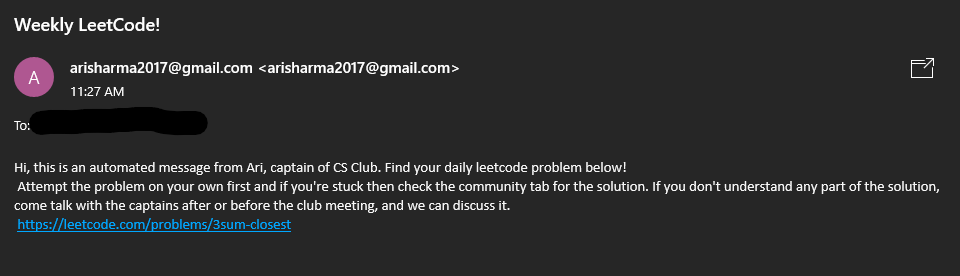

# DailyLeetEmail

### This repo contains the code I created to send emails with randomized practice problems to members of CS Club 😀

#### Everyone is busy during the school year so getting a chance to practice is next to impossible but with daily emails containing LeetCode problems at different levels, members are able to get in more practice! 

##### This uses AWS Lambda, DynamoDB, and EventBridge to send different practice problems.

###### Example Email:  

